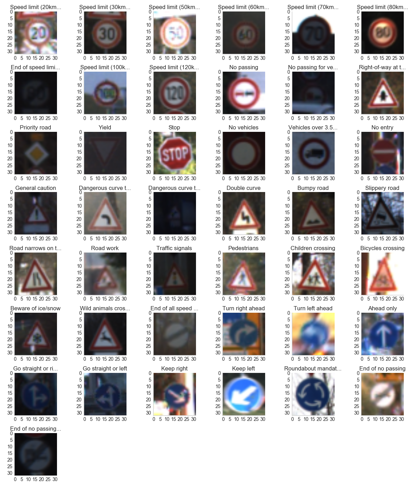
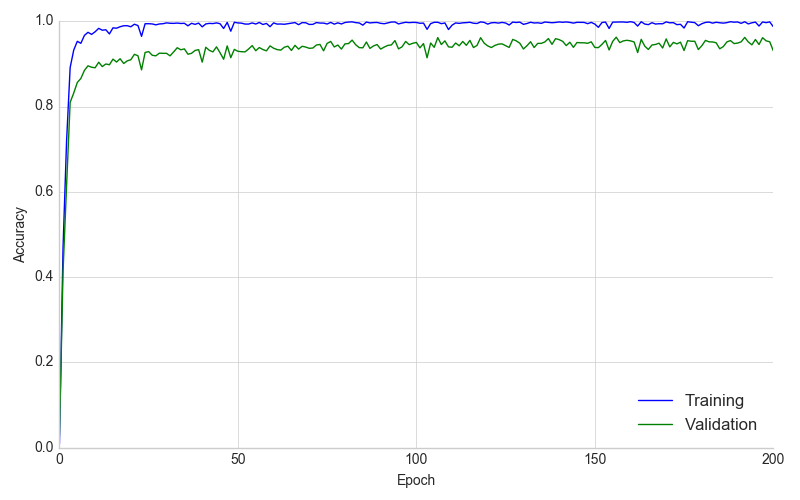
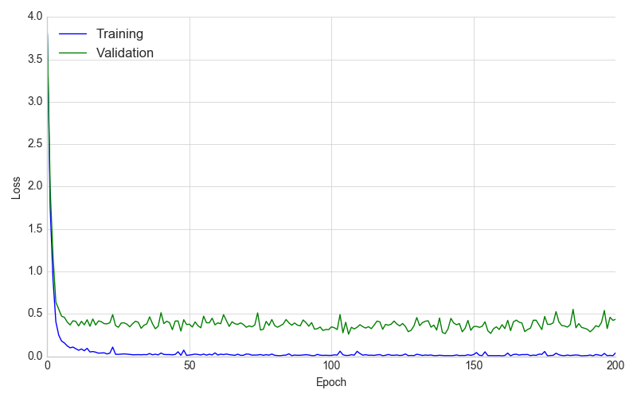
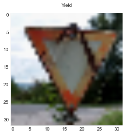
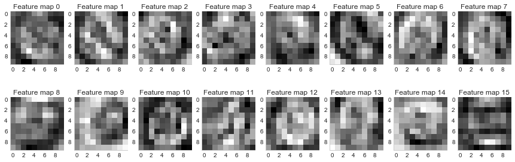

# Traffic Sign Recognition
[](http://www.udacity.com/drive)

## Overview

In this project, you will use what you've learned about deep neural networks and convolutional neural networks to classify traffic signs. You will train and validate a model so it can classify traffic sign images using the [German Traffic Sign Dataset](http://benchmark.ini.rub.de/?section=gtsrb&subsection=dataset). After the model is trained, you will then try out your model on images of German traffic signs that you find on the web.

We have included an Ipython notebook that contains further instructions 
and starter code. Be sure to download the [Ipython notebook](https://github.com/udacity/CarND-Traffic-Sign-Classifier-Project/blob/master/Traffic_Sign_Classifier.ipynb). 

We also want you to create a detailed writeup of the project. Check out the [writeup template](https://github.com/udacity/CarND-Traffic-Sign-Classifier-Project/blob/master/writeup_template.md) for this project and use it as a starting point for creating your own writeup. The writeup can be either a markdown file or a pdf document.

To meet specifications, the project will require submitting three files:

* the Ipython notebook with the code
* the code exported as an html file
* a writeup report either as a markdown or pdf file

## The Project

The goals / steps of this project are the following:

* Load the data set
* Explore, summarize and visualize the data set
* Design, train and test a model architecture
* Use the model to make predictions on new images
* Analyze the softmax probabilities of the new images
* Summarize the results with a written report

### Dependencies

This lab requires:

* [CarND Term1 Starter Kit](https://github.com/udacity/CarND-Term1-Starter-Kit)

The lab environment can be created with CarND Term1 Starter Kit. Click [here](https://github.com/udacity/CarND-Term1-Starter-Kit/blob/master/README.md) for the details.

### Dataset and Repository

1. Download the data set. The classroom has a link to the data set in the "Project Instructions" content. This is a pickled dataset in which we've already resized the images to 32x32. It contains a training, validation and test set.
2. Clone the project, which contains the Ipython notebook and the writeup template.

```sh
git clone https://github.com/udacity/CarND-Traffic-Sign-Classifier-Project
cd CarND-Traffic-Sign-Classifier-Project
jupyter notebook Traffic_Sign_Classifier.ipynb
```

### Project code

The project is implemented in the [`Traffic_Sign_Classifier.ipynb`](Traffic_Sign_Classifier.ipynb) Jupyter notebook.

## Project summary / writeup

The goals / steps of this project are the following:

* Loading the data set (see below for links to the project data set)
* Exploring, summarizing and visualizing the data set
* Designing, training and testing a model architecture
* Using the model to make predictions on new images
* Analyzing the softmax probabilities of the new images
* Lastly, summarizing the results with a written report

## Rubric Points
### Here I will consider the [rubric points](https://review.udacity.com/#!/rubrics/481/view) individually and describe how I addressed each point in my implementation.  

---

### Data Set Summary & Exploration

#### 1. Provide a basic summary of the data set. In the code, the analysis should be done using python, numpy and/or pandas methods rather than hardcoding results manually.

I used the pandas library to calculate summary statistics of the traffic
signs data set:

* As far as the project is concerned, the dataset consists of 32x32 pixel RGB images, each labeled with a traffic sign class.
    * The size of training set is `34799` images.
    * The size of the validation set is `4410` images.
    * The size of test set is `12630`.
    * The shape of a traffic sign image is `32x32x3` (RGB).
    * The number of unique classes/labels in the data set is `43`. Since SoftMax likelihood is used for the classification, and additional "background" class was introduced, giving `44` classes as far as the training is concerned.

#### 2. Include an exploratory visualization of the dataset.

Here are sample images from each class:



We immediately find that some of them appear to be very dark. In order to get a better understanding of the average example per class, let's look at the class means:


This is much better, but we still find that some classes (such as the 80 km/h speed limit signs) contain mostly images
that are much darker than those of other classes (e.g. the 30 km/h speed limit signs). This may bias the classifier
towards these labels when darker images are used.


In addition, we can immediately see that these two classes are extremely easy to mistake for the other even for humans, so care should be taken here.

We also note that some of the images are mirrored versions of the others, specifically the "go straight or right" and "go straight or left", as well as the "keep right" and "keep left" signs. This limits the options for later data augmentations,
as simple horizontal flipping severely changes the meaning of these signs.
We can also differentiate "no" signs ([Verbotszeichen](https://de.wikipedia.org/wiki/Verbotszeichen) and "do" signs ([Gebotszeichen](https://de.wikipedia.org/wiki/Gebotszeichen)) by color, the former being red, the latter being blue. Interestingly, some papers find that ignoring color results in higher classification accuracy.

When looking at the images as they appear in the dataset, we also find that they tend
to look extremely similar. This might be simply due to the was the images were collected
while driving a car:


To ensure that images actually vary, we can now look at e.g. the last few images per class
where we indeed observe some variation:


When looking at the class distribution, we find that some classes are severely underrepresented compared to others. While there are 180 examples for the 20 km/h speed limit, we find about 2010 examples for the 50 km/h speed limit. The average number of examples per class was 809, at a median of 540.


We could mitigate this by augmenting images in the underrepresented classes or by using stratified sampling across classes, then uniform sampling within each class during training.

### Design and Test a Model Architecture

#### 1. Describe how you preprocessed the image data. What techniques were chosen and why did you choose these techniques? Consider including images showing the output of each preprocessing technique. Pre-processing refers to techniques such as converting to grayscale, normalization, etc.

In order to establish a baseline, the images were simply normalized to a `-1...1` value
range before passing them to the simple LeNet-like model.

In later experiments, the images were normalized according to the training dataset
mean and variance, while adding scale, rotation and shift augmentations using the [imgaug](https://github.com/aleju/imgaug) library, resulting in a slightly higher validation and test accuracy.

Here's an example of an unaltered input image:


By adding randomized augmentations, here's one possible variation of the above image:


Experiments with grayscale images were not conducted, however a third and fourth experiment
was run using depthwise separable convolutions with trivially (i.e. range) normalized
images in YUV color space. The reasoning here was that papers reported higher accuracy
with grayscale images (here represented by the Y channel); as previously described
however, color information should provide some discriminative advantage for classification
of traffic signs, as different classes of signs exhibit different colors (mostly red, blue and white). 

#### 2. Describe what your final model architecture looks like including model type, layers, layer sizes, connectivity, etc.) Consider including a diagram and/or table describing the final model.

My final model consisted of two convolutional and three fully connected layers
the following layers:

| Layer         		|     Description	        					| 
|:---------------------:|:---------------------------------------------:| 
| Input         		| 32x32x3 RGB image                             |
| Range normalization   |                                               | 
| Convolution 5x5     	| 1x1 stride, valid padding, 6 filters          |
| RELU					|												|
| Max pooling 2x2       | 2x2 stride                                    |
| Convolution 5x5     	| 1x1 stride, valid padding, 16 filters         |
| RELU					|												|
| Max pooling 2x2       | 2x2 stride                                    |
| Fully connected       | 120 output neurons                            |
| RELU					|												|
| Fully connected       | 84 output neurons                             |
| RELU					|												|
| Fully connected       | 44 output neurons                             |
| Softmax				|            									|

A different approach using residual/skip connections was implemented as well, but
resulted in a worse classification accuracy. Some variations of this setup
were used and experimented with, including different setups of fully connected
layers, number of filters, dropout, etc.

| Layer         		|     Description	        					| 
|:---------------------:|:---------------------------------------------:| 
| Input         		| 32x32x3 RGB image                             |
| Range normalization   |                                               | 
| Depth Convolution 5x5     	| depthwise separable, depth multiplier 16, 1x1 stride, valid padding, 6 filters          |
| Max pooling 5x5       | 5x5 stride                                    |
| Batch normalizartion	|												|
| RELU					| Flattened as fc_1	                            |
| Convolution 3x3     	| 1x1 stride, valid padding, 16 filters         |
| Max pooling 3x3       | 3x3 stride                                    |
| RELU					|												|
| Convolution 3x3     	| 1x1 stride, valid padding, 16 filters         |
| RELU					| Flattened as fc_3                             |
| Concatenation         | Combining fc_1 and fc_3 flattened outputs     |
| Fully connected       | 24 output neurons bottleneck                  |
| RELU					|												|
| Fully connected       | 44 output neurons                             |
| Softmax				|            									|

#### 3. Describe how you trained your model. The discussion can include the type of optimizer, the batch size, number of epochs and any hyperparameters such as learning rate.

The model was trained using the Adam optimizer with a learning rate of `1e-4` and,
at times, `1e-3` and `1e-5`. The training was bottlenecked by the CPU, so batch size
was kept fairly small at around `32` images per batch so as to not stall in the
single-threaded preprocessing part for too long. The number of epochs was varied
between `100` and `1000`, however no improvement was observed after
approximately `300` epochs; due to time constraints, between `100` and `200`
epochs were used ultimately.

#### 4. Describe the approach taken for finding a solution and getting the validation set accuracy to be at least 0.93. Include in the discussion the results on the training, validation and test sets and where in the code these were calculated. Your approach may have been an iterative process, in which case, outline the steps you took to get to the final solution and why you chose those steps. Perhaps your solution involved an already well known implementation or architecture. In this case, discuss why you think the architecture is suitable for the current problem.

My final model results were:
* training set accuracy was not logged numerically (since training snapshots were taked based on the validation accuracy). The following image shows a training accuracy around `1.0`. 
* validation set accuracy of `0.963` 
* test set accuracy of `0.87`.

##### Training accuracy

Training accuracy quickly went toward `1.0`, indicating beginning of overfitting.
Due to dataset augmentation however, training accuracy grew as well.



##### Training loss

We find the loss is oscillating a bit but appears to still shrink. This indicates
that lowering the learning rate and training for more iterations/epochs could be beneficial.



With the custom network, a

* lower validation set accuracy of `0.927` at 
* a higher test set accuracy of `0.91` were achieved.
 
The experiments with a custom architecture followed the following assumptions:

- The network should not be too deep in order to keep it small and fast, as an
ultimate goal would be to run it in realtime on an embedded device.
- By using depthwise separable convolutions in the input layers, the network is forced to learn filters specific to the domain of the input image color space.
- Residual connections should allow the network to utilize higher and lower level features
for class discrimination.
- A bottleneck layer forces the network to compress information, thus requires it to
generalize.
- Using batch normalization, the need to accurately normalize the input images is removed. This should also allow to experiment with different image color spaces during
training without requiring to create different variations of training, validation and test datasets.
- Dropout was eventually removed due to the small number of neurons in the concatenated layer.

Interestingly, the training did not reach high accuracies as fast as with the LeNet
approach and failed to correctly classify the extra test images; at the same time,
it resulted in a higher accuracy on the test dataset.

### Test a Model on New Images

#### 1. Choose five German traffic signs found on the web and provide them in the report. For each image, discuss what quality or qualities might be difficult to classify.

Six extra images were used to test the accuracy of the network:





Two of the images were chosen specifically because they are slightly obstructed.

#### 2. Discuss the model's predictions on these new traffic signs and compare the results to predicting on the test set. At a minimum, discuss what the predictions were, the accuracy on these new predictions, and compare the accuracy to the accuracy on the test set (OPTIONAL: Discuss the results in more detail as described in the "Stand Out Suggestions" part of the rubric).

Evaluation accuracy on the custom images varied somewhat between different training runs, resulting in accuracies between 4/6 (`0.67`) and 6/6 (`1.0`). 

Here are the results of the prediction using the LeNet architecture (4/6 correct):

| Image			        |     Prediction	        					| Confidence | 
|:---------------------:|:---------------------------------------------:|:----------:| 
| 80 km/h speed limit   | 80 km/h speed limit                       	| 0.99 |
| Beware of ice/snow    | Children crossing                             | 1.00 |
| Roundabout mandatory  | Yield											| 1.00 |
| Yield	                | Yield      					 				| 1.00 |
| Yield	 (dirty)        | No vehicles        							| 1.00 |
| Priority road	(dirty) | Priority road      							| 1.00 |

The high confidences at wrong results might indicate some overfitting.

Here's the result for the custom architecture (5/6 correct):

| Image			        |     Prediction	        					| Confidence |
|:---------------------:|:---------------------------------------------:|:----------:| 
| 80 km/h speed limit   | 80 km/h speed limit                       	| 1.00 |
| Beware of ice/snow    | Right-of-way at the next intersection         | 0.96 |
| Roundabout mandatory  | Roundabout mandatory                          | 1.00 | 
| Yield	                | Bumpy Road					 				| 1.00 |
| Yield	 (dirty)        | Yield               							| 0.89 |
| Priority road	(dirty) | Priority road      							| 1.00 |

### (Optional) Visualizing the Neural Network (See Step 4 of the Ipython notebook for more details)
#### 1. Discuss the visual output of your trained network's feature maps. What characteristics did the neural network use to make classifications?

When looking at the activations of the first layer of the LeNet model for an 80 km/h speed limit sign, we find that the network responds strongly to red and black pixels,
vertical, diagonal and horizontal edges.


The second layer activations are a bit harder to interpret, but do still seem to
exhibit the same pattern of horizontal, vertical and diagonal line activations.


